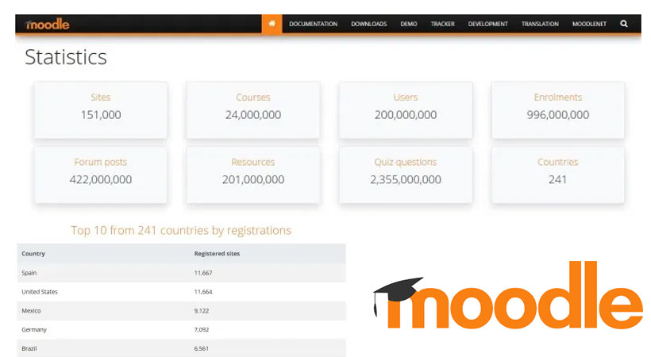
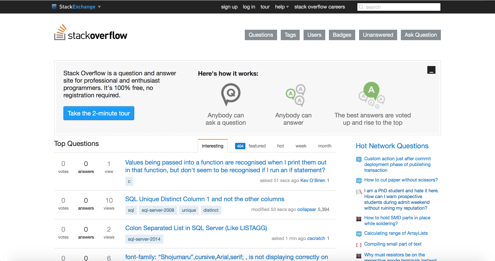

# Assignment 1

## Personal Intro
My name is Jesse Kearl. I live in Lethbridge currently but grew up in Calgary. I am in the Math Education Combined Degree program here at the University. This is the last remaining class of my degree! I would say my two main hobbies are climbing and coding. I frequently go on climbing trips in the Canadian Rockies, and throughout the United States. Recently in my life my sister had a baby and I am very stoked about that.

## Online Learning Reflections
I consider myself very familiar with technology. I have interacted with online learning for basically as long as I can remember. I remember getting D2L at the CBE as early as grade five or six. Throughout my grade school education online was an important aspect of most classes. It wasn't until high school until I took a class that was solely online, and in that class I did very poorly and I think ended up dropping the class, I think largely because of a lack of motivation. Since then into post-secondary I have learned how to be more involved in a course that's online, but I've seen how important it is to make sure the students engaged. I think a big thing with that is making sure the instructor is available for contact often, and quickly reponds to questions from students. I think it helps also to see that the instructor and other students are real people by using video conferencing. During the pandemic I was in PSII which ended up getting cancelled, so I haven't experienced any other online learning until this class started on Monday.

To connect with my teacher and peers in this class I plan to comment a lot on forum posts. I see this as the main opportunity for that to happen. I already know some other students in the class so I think this will help get my foot in the door in this regard.

## Course Goals
1. Learn about different online learning frameworks available to educators
2. Learn ways that students and instructors can connect in an online teaching environment
3. Learn how to keep students engaged in a fully online class

---

# Assignment 4: Web-based Resource Project

## Alberta Education Outcomes

This course is included in the BIT cluster (Business/Admin/Finance/IT) of the CTS curriculum for Alberta Ed. The course would be considered CSE1210: Client-side Scripting 1. The project fulfills the following outcomes:

2. demonstrate an understanding of the general nature and purpose of Internet-oriented markup languages

* compare and contrast markup and scripting languages

3. design, write and debug code using an appropriate Internet markup language

* demonstrate the ability to use an appropriate markup language coding environment
* use appropriate techniques to design a markup language document

## Objectives

This project has the following student objectives:

*Students will be able to..*

* Identify different coding tools and the roles each of them play in industry
* Identify the difference between the languages of JavaScript, CSS, and HTML
* Create a basic web page using CSS styling and a basic JavaScript event listener
* Use code from other parts of the internet in their own project

## Lesson Details

### Rationale

This project introduces students to the basics of web development. This is an important skill because of how central of a role the web plays in both our social and economic lives. Through this project students will learn about various important pieces of software and web apps that are used in the industry by professionals. The project will give students a look into how much skill is required to write a complex website.

### General Lesson Structure

The project will take place of the course of a week. The project will be introduced on the first day and students will be able to work ahead as far as they want throughout the week. Students will have already learned the basics of HTML, CSS, and JavaScript, and this project is best used a unit-end summative project. Each day there will be a video conference lesson that will cover various requirements of the project. These will be covered in the sequence that the project should be logically worked on. After each video conference lesson there will be a question and answer period as well as an opportunity to set up one-on-one sessions with students. Below is a brief breakdown of what the lesson of each day will include.

### Differentiation

Differentiation can easily be provided in the project by adding or taking away requirements from the rubric based on student ability. Some students really enjoy programming and will no doubt take this project much further past expectations. In this case the instructor can provide links with other ideas of things they can add to the website. For lower achieving students a good idea would be to remove the JavaScript aspect of the project as well as the Code Pen animation import.

### Schedule

*Day 1: Project Introduction*:

* Instructor does an introduction of the project
* Talks about the project rubric and expectations
* Gives a brief overview of all software tools that will be used for the project
* Instructor fields any questions about the project from students
* Instructor will show students who are interested how to switch text editors to VS Code
* VS Code will be compared to other editors to show its benefits
* Other text editors will be briefly introduced and a few features will be shown
* Instructor will show students how they can transfer all former preferences into VS Code

*Day 2: Stack Overflow*:

* Instructor will introduce the website Stack Overflow. Many student may already be familiar
* Instructor will google a few questions and show how easy it is to find Stack Overflow answers
* The home page of the website will be shown and students will be shown how to post questions
* Account creation will be shown by the instructor
* Instructor will show students how to favourite questions for future reference

*Day 3: GitHub*:

* The website GitHub is introduced to students
* Instructor will show a video about the impact of GitHub of open source software
* Instructor will go through the basic features of GitHub using a screen share
* Account creation tutorial will be shown be instructor
* The basics of the software Git will be introduced that GitHub is based on
* Instructor will go through how students will upload their own repository onto GitHub
* Instructor will show students how to make a commit to their repository

*Day 4: Code Pen*:

* The website Code Pen is introduced to students
* Instructor will go through Code Pen and show various uses of Code Pen
* Instructor will show how to set up a Code Pen account
* The in-browser text editor will be shown and a basic "Pen" will be set up
* Students will be instructed to find a few Pens that will be useful for their website

*Day 5: Peer Evaluations*:

* Students will have completed projects for this class period
* Students will be instructed to post the links to their GitHub repositories
* Each student will create a forum posting with their repository link
* Each student will clone the repository of two other students and examine their webpage
* Students will leave a reply post with a peer evaluation for each cloned repository

## Project Exemplar

I have created a project exemplar for students to have an idea of what their page should look like. I have included both a link to the page and a download link for the exemplar repository that includes the HTML, CSS, Javascript, and image file.

[Link to exemplar page](exemplar/exemp.html)

[Download exemplar folder](exemplar.zip)

## Rubric

Students will create a website to present content of their choosing. The site must contain the following list of features:

### HTML (12 marks)

*Head Tag* /2:

* Document must contain head tag
* Head tag must contain description, author, and site title

*Nav Bar* /3:

* must have a nav bar
* must have a link to at least one other webpage (can be any website)
* must stick to the top of the page on scroll (use "position: fixed" on stylesheet)

*Tags* /6:

* Use of at least two levels of headings
* Use of a paragraph tag
* Use of an ordered or unordered list tag
* Use of at least one image
* Use of at least one iframe with an embedded Youtube video
* Use of a button

*Imports* /1:

* Import at least one style sheet and one JavaScript file

### CSS (14 marks)

*Style Categories* /3:

* Custom style HTML tags using the tag name, a class name, and an ID

*Style Attributes* /8:

Style document using all of the following attributes in your stylesheet:

* font-family
* color
* padding
* margin
* float
* position
* background-color
* width

*CSS Animation (Code Pen)* /3:

* A Simple hoverable CSS animation found on Code Pen. This can be directly copied and pasted as long as the animation is labelled and the link is provided
        
### JavaScript (5 marks)

*Button Event* /5:

* Use an event listener attached to a button to create an event that happens on click

### Other (8 marks)

*Stack Overflow* /4:

* Link at least two questions you used from Stack Overflow to the page and what they helped you solve
* If you didn't need anything from SO just link two interesting things you learned on SO
* Give a couple sentences on what you learned from these questions

*GitHub* /4:

* The assignment was published using a GitHub repository which was linked in the student forums
* The repository had at least two commits.

## Tech Tools

### Text Editor (VS Code)

A Text Editor is program designed to optimize the experience of writing code. It has many features that something like Microsoft Word would not. A few of these would be syntax highlighting, a file navigation sidebar, language autocomplete, integration with Git and GitHub, code linting, a built in command line interface, and more. The editor I would suggest having all students install and use is VS Code, made by Microsoft. This is probably the most popular text editor in the industry today which is a major selling point in itself. It's also just a great text editor for beginners because of its many helpful features. However, any text editor that a student feels comfortable with will do the job. It may just be easier to communicate with students when everyone is using the same editor.

### Moodle (or any online classroom software)

Moodle is a software that will be familiar to any University of Lethbridge student. It is a web application usedto host online classes. This will be necessary in this class because the project requires students to post the web page they create and have other students comment on their work. Moodle has this built in but then it can also be used for things like assignment grading. The software in this situation does not have to be Moodle, but any classroom management software where forums can be created. I use Moodle here because it's a software I am familiar with on the student side.

### GitHub

GitHub is the central location for all open source software on the web. The site has over a hundred million repositories. The name originates from the version control software it uses called *Git*. Git is the version control software developed by Linus Torvalds used in the open source operating system *Linux*. GitHub is a useful tool to learn because it is so commonly used in industry so it is a great skill to learn. It's also useful to use for updating software while still having ease access to old versions of the repository.

### Code Pen

Code Pen is an online code editor where users can easily display code snippets they have created in HTML, CSS, and JavaScript. Showing off code snippets without services like Code Pen would be very difficult. Viewers would have to download others' code and run it on their own local server or open in the browser to view the content. This isn't practical when what is being showcased is only a few lines of code. Code Pen interprets the code in the in-browser and displays the output in a separate graphical window. It's also used as a place to test code in an isolated environment and find any issues or bugs.

### Stack Overflow

Stack Overflow is the number one place on the internet for finding answers to coding problems and questions. There are around 2.5 million answered questions on the site across many different programming languages. There is a question and answer to almost any coding question that is reasonably general. For students who want to increase their coding knowledge on their own Stack Overflow is an essential online tool for self-education.

