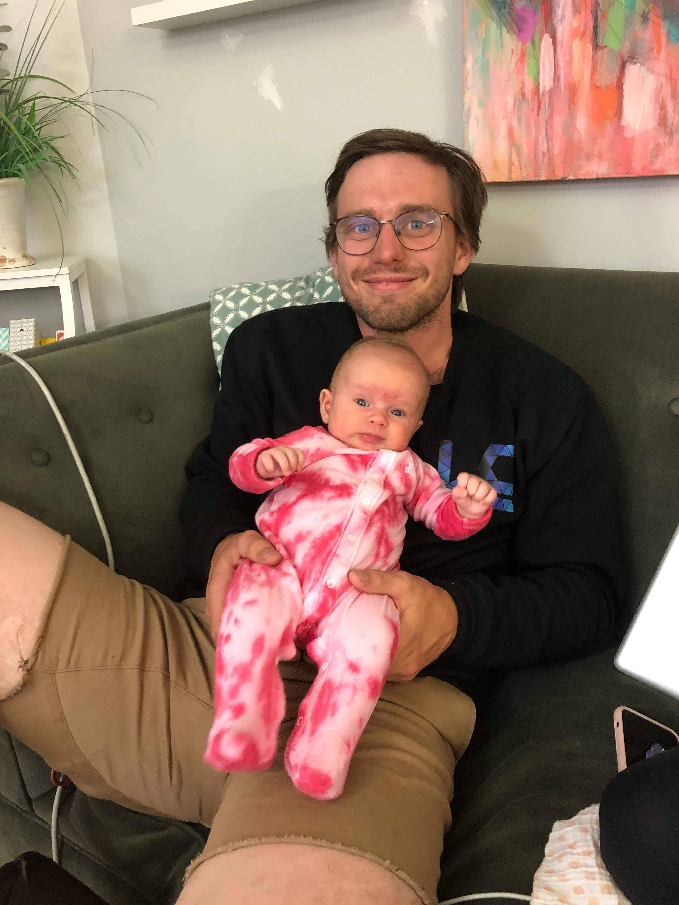

# Assignment 1

## Personal Intro
My name is Jesse Kearl. I live in Lethbridge currently but grew up in Calgary. I am in the Math Education Combined Degree program here at the University. This is the last remaining class of my degree! I would say my two main hobbies are climbing and coding. I frequently go on climbing trips in the Canadian Rockies, and throughout the United States. Recently in my life my sister had a baby and I am very stoked about that.

## Online Learning Reflections
I consider myself very familiar with technology. I have interacted with online learning for basically as long as I can remember. I remember getting D2L at the CBE as early as grade five or six. Throughout my grade school education online was an important aspect of most classes. It wasn't until high school until I took a class that was solely online, and in that class I did very poorly and I think ended up dropping the class, I think largely because of a lack of motivation. Since then into post-secondary I have learned how to be more involved in a course that's online, but I've seen how important it is to make sure the students engaged. I think a big thing with that is making sure the instructor is available for contact often, and quickly reponds to questions from students. I think it helps also to see that the instructor and other students are real people by using video conferencing. During the pandemic I was in PSII which ended up getting cancelled, so I haven't experienced any other online learning until this class started on Monday.

To connect with my teacher and peers in this class I plan to comment a lot on forum posts. I see this as the main opportunity for that to happen. I already know some other students in the class so I think this will help get my foot in the door in this regard.

## Course Goals
1. Learn about different online learning frameworks available to educators
2. Learn ways that students and instructors can connect in an online teaching environment
3. Learn how to keep students engaged in a fully online class

---

# Web-based Resource Project