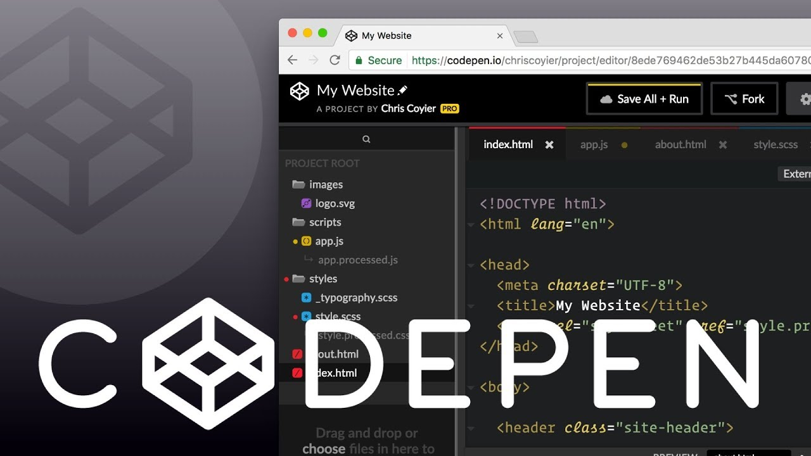

# Assignment 1

## Personal Intro
My name is Jesse Kearl. I live in Lethbridge currently but grew up in Calgary. I am in the Math Education Combined Degree program here at the University. This is the last remaining class of my degree! I would say my two main hobbies are climbing and coding. I frequently go on climbing trips in the Canadian Rockies, and throughout the United States. Recently in my life my sister had a baby and I am very stoked about that.

## Online Learning Reflections
I consider myself very familiar with technology. I have interacted with online learning for basically as long as I can remember. I remember getting D2L at the CBE as early as grade five or six. Throughout my grade school education online was an important aspect of most classes. It wasn't until high school until I took a class that was solely online, and in that class I did very poorly and I think ended up dropping the class, I think largely because of a lack of motivation. Since then into post-secondary I have learned how to be more involved in a course that's online, but I've seen how important it is to make sure the students engaged. I think a big thing with that is making sure the instructor is available for contact often, and quickly reponds to questions from students. I think it helps also to see that the instructor and other students are real people by using video conferencing. During the pandemic I was in PSII which ended up getting cancelled, so I haven't experienced any other online learning until this class started on Monday.

To connect with my teacher and peers in this class I plan to comment a lot on forum posts. I see this as the main opportunity for that to happen. I already know some other students in the class so I think this will help get my foot in the door in this regard.

## Course Goals
1. Learn about different online learning frameworks available to educators
2. Learn ways that students and instructors can connect in an online teaching environment
3. Learn how to keep students engaged in a fully online class

---

# Web-based Resource Project

## Assignment

### Objectives

OBJECTIVES

### Requirements

Students will create a website to present content of their choosing. The site must contain the following list of features:

HTML Requirements:
    * A header bar with the title of the site
    * A top or side nav bar with a link to at least one other page
    * Use of at least two levels of headings
    * Use of at least one image
    * Use of at least one iframe
    * Import at least one style sheet and one JavaScript file

CSS Requirements:
    * Use of at least five custom CSS styles
    * styles of all three of a tag type, class name, and ID
    * style at least one element using the "position" attribute
    * styles using the attributes "border", "padding", and "margin"
    * Adapt one CSS animation from Code Pen to your own web page

JavaScript Requirements:
    * Use of at least one event listener
    * Dynamic page update based on form submission

Other Requirements:
    * Link at least two questions you used from Stack Overflow to the page and what they helped you solve
    * If you didn't need anything from SO just link two interesting things you learned on SO
    * Site can open on double click of the html file or through live-server

## Tech Tools

### Text Editor (VS Code)

A Text Editor is program designed to optimize the experience of writing code. It has many features that something like Microsoft Word would not. A few of these would be syntax highlighting, a file navigation sidebar, language autocomplete, integration with Git and GitHub, code linting, a built in command line interface, and more. The editor I would suggest having all students install and use is VS Code, made by Microsoft. This is probably the most popular text editor in the industry today which is a major selling point in itself. It's also just a great text editor for beginners because of its many helpful features. However, any text editor that a student feels comfortable with will do the job. It may just be easier to communicate with students when everyone is using the same editor.

### Free Code Camp

Free Code Camp is a nonprofit, open source website devoted to teaching people how to code. It has a very simple interface and is great because progress is very measurable. This is an easy thing to assign because Free Code Camp does all the marking for automatically. All the instructor needs to do is check completion. It's also guaranteed to help students improve their coding skills and teach them the nuances of different coding languages. In coding it's all about learning by doing, and Free Code Camp Provides that.

### Moodle (or any online classroom software)

Moodle is a software that will be familiar to any University of Lethbridge student. It is a web application usedto host online classes. This will be necessary in this class because the project requires students to post the web page they create and have other students comment on their work. Moodle has this built in but then it can also be used for things like assignment grading. The software in this situation does not have to be Moodle, but any classroom management software where forums can be created. I use Moodle here because it's a software I am familiar with on the student side.

### GitHub

GitHub is the central location for all open source software on the web. The site has over a hundred million repositories. The name originates from the version control software it uses called *Git*. Git is the version control software developed by Linus Torvalds used in the open source operating system *Linux*. GitHub is a useful tool to learn because it is so commonly used in industry so it is a great skill to learn. It's also useful to use for updating software while still having ease access to old versions of the repository.

### Code Pen

Code Pen is an online code editor where users can easily display code snippets they have created in HTML, CSS, and JavaScript. Showing off code snippets without services like Code Pen would be very difficult. Viewers would have to download others' code and run it on their own local server or open in the browser to view the content. This isn't practical when what is being showcased is only a few lines of code. Code Pen interprets the code in the in-browser and displays the output in a separate graphical window. It's also used as a place to test code in an isolated environment and find any issues or bugs.

### Stack Overflow

Stack Overflow is the number one place on the internet for finding answers to coding problems and questions. There are around 2.5 million answered questions on the site across many different programming languages. There is a question and answer to almost any coding question that is reasonably general. For students who want to increase their coding knowledge on their own Stack Overflow is an essential online tool for self-education.

## Lesson Details

### General Lesson Structure

The project will take place of the course of a week. The project will be introduced on the first day and students will be able to work ahead as far as they want throughout the week. Each day there will be a video conference lesson that will cover various requirements of the project. These will be covered in the sequence that the project should be logically worked on. After each video conference lesson there will be a question and answer period as well as an opportunity to set up one-on-one sessions with students. Below is a brief breakdown of what the lesson of each day will include.

### Day 1: Project Introduction
Instructor does an introduction of the project. Talks about the project rubric and expectations. Gives a brief overview of all software tools that will be used for the project.

### Day 2
* FCC
* How to set up npm and your work station with your chosen code editor

### Day 3
* FCC
* Create SO account and show how site works

### Day 4
* Exploration of Code Pen and setup of account

### Day 5
* Post and forum comments
